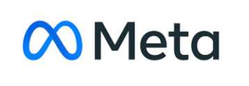

## Overview

The 6th Workshop on Gender Bias in Natural Language Processing is taking place on **August 1st 2025**, as part of [ACL 2025](https://2025.aclweb.org/) in Vienna.

The workshop will take place in **Hall C**.

  

## Organisers

- 
<a href="https://scholar.google.com.eg/citations?user=39XNRZ0AAAAJ&hl=en&oi=ao">Christine Basta</a>, Alexandria University

- 
<a href="https://scholar.google.com/citations?user=ESqQ7FoAAAAJ&hl=en">Marta R. Costa-jussà</a>, FAIR, Meta

- 
<a href="https://scholar.google.com/citations?user=r5TPYZwAAAAJ&hl=en">Agnieszka Faleńska</a>, University of Stuttgart

- 
<a href="https://deboranozza.com/">Debora Nozza</a>, Bocconi University

- 
<a href="https://karstanczak.github.io/">Karolina Stańczak</a>, ETH AI Center

  

## Sponsors

[BOUQuET: Benchmark and Open initiative for Universal Quality Evaluation in Translation](https://bouquet.metademolab.com/)

  

## Contact
If you have any questions, please get in touch at <a href="mailto:gebnlpworkshop@gmail.com">gebnlpworkshop@gmail.com</a>
